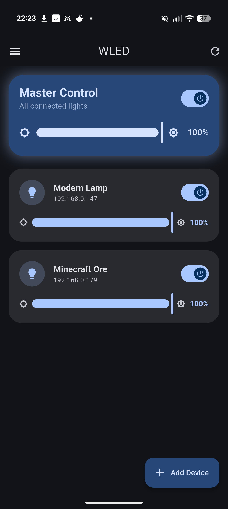
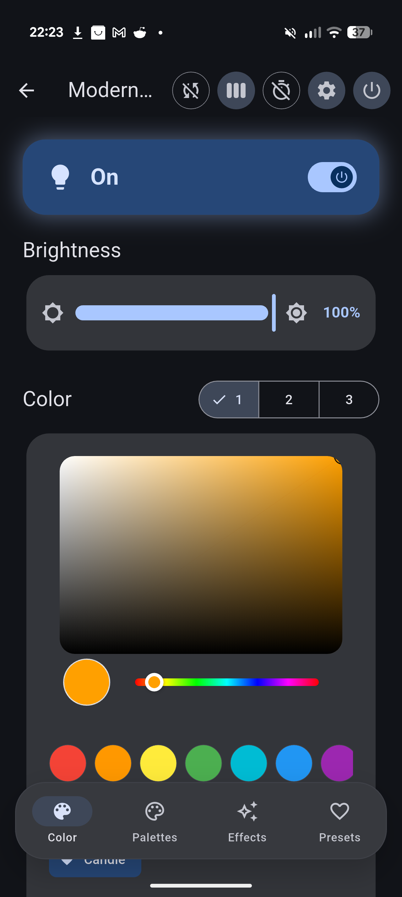
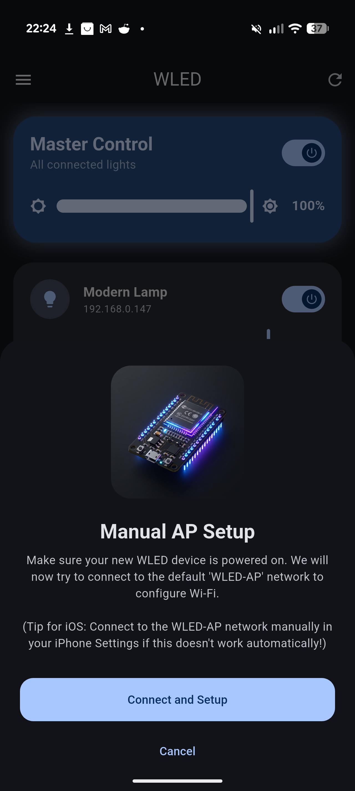
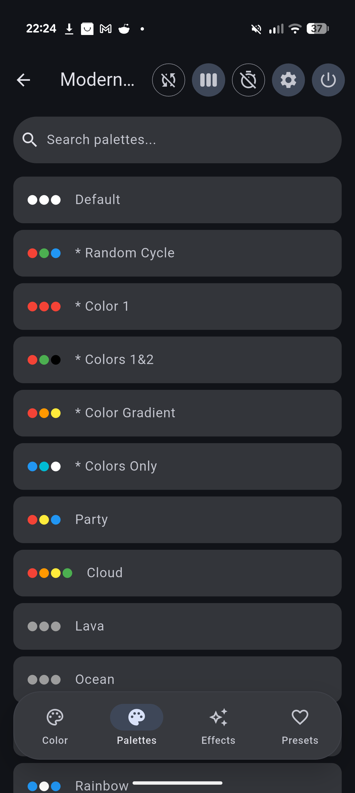
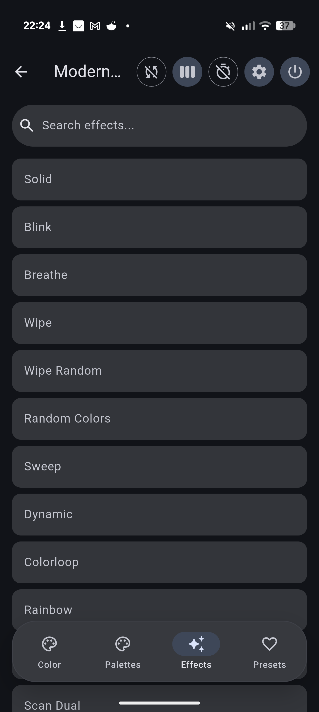
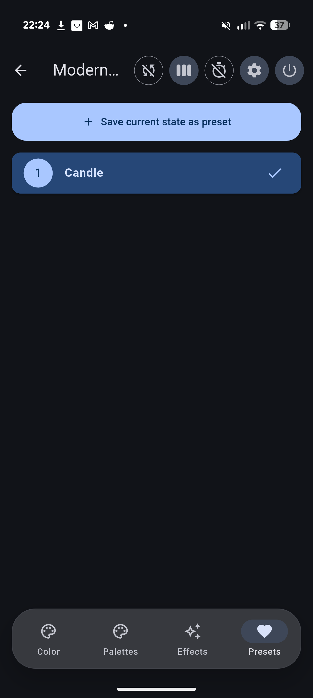
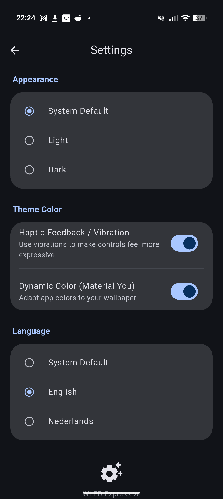

# WLED-Expressive-App 🎨💡

A beautiful, modern, Material 3-focused remote control app for WLED devices. Designed for fluid, expressive interactions and full tablet/landscape support.

## Features ✨

- **Material 3 Expressive Design**: Beautiful, modern UI with smooth animations, satisfying "squishing" Expressive Switches, and fluid sliders that match the latest Android system designs.
- **Dynamic Color Support**: Seamless integration with Android 12+ Material You dynamic coloring. The app adapts beautifully to your wallpaper.
- **Responsive Master-Detail Layout**: Intelligent split-screen layout for tablets and landscape orientations, offering a seamless desktop-grade management experience alongside your list.
- **Theme Customization**: Toggle between Light, Dark, and System modes. Manual seed color selection when dynamic color is disabled.
- **Master Control**: Control all online WLED devices at once (global brightness, power off).
- **Auto-Discovery**: Automatically find WLED devices on your local network using mDNS.
- **Deep WLED Integration**: Full control over colors, effects, palettes, and presets for individual lamps.

## Screenshots 📸

  
  
  

  
  
  

  

## Installation 🚀

You can download pre-compiled releases for your platform from the [GitHub Releases](../../releases) section.

### Android
Download the `app-release.apk` file to your phone and install it. Make sure you have enabled installing apps from unknown sources in your settings.

### Windows
Download the `wled_expressive_windows.zip` file, extract it to a folder of your choice, and run `wled_expressive.exe`. No installation is required.

### Linux
Download the `wled_expressive_linux.tar.gz` bundle, extract the archive, and execute the `wled_expressive` binary.

### Building from Source
If you want to build the app yourself or test it on macOS/iOS:
1. Ensure you have [Flutter](https://flutter.dev/docs/get-started/install) installed.
2. Clone this repository.
3. Run `flutter pub get`.
4. Run `flutter run` or build it for your specific platform using `flutter build`.

## Built With ❤️ & 🛠️

- [Flutter](https://flutter.dev)
- [Dynamic Color](https://pub.dev/packages/dynamic_color)
- [Shared Preferences](https://pub.dev/packages/shared_preferences)
- [Multicast DNS](https://pub.dev/packages/multicast_dns)
